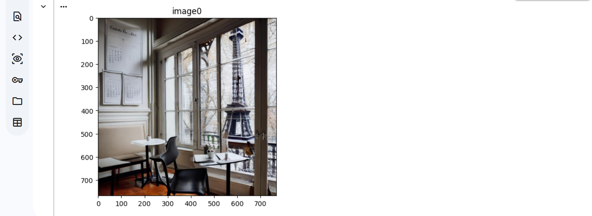
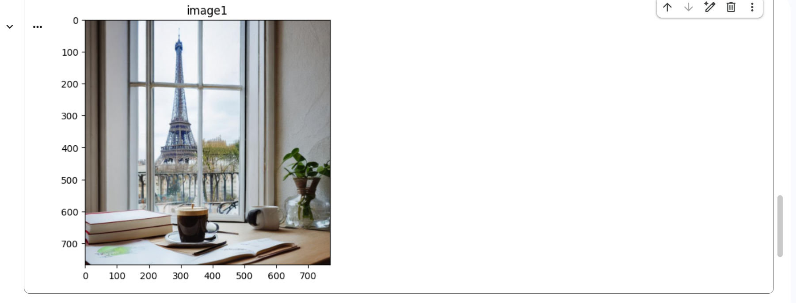
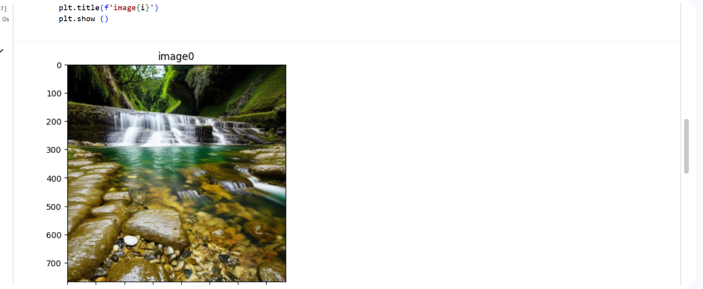
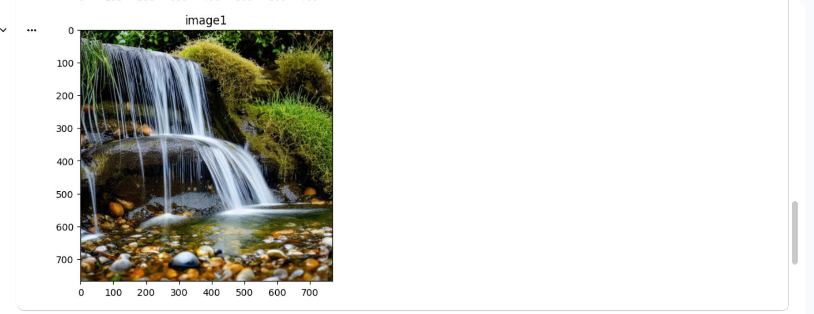

# AI Image Generation using Stable Diffusion

An AI-powered image generation project built with PyTorch and Hugging Face's `diffusers` library using the `dreamlike-art/dreamlike-photoreal-2.0` model.

## Features
* Generates high-quality photorealistic images from textual descriptions.
* Saves generated images locally as `.png` files.
* Displays output visualizations directly using `matplotlib`.

## Prerequisites
* GPU with CUDA support (e.g., NVIDIA GPU or Google Colab T4 GPU).

## Setup & Installation

1. Install required dependencies:
   ```bash
   pip install -r requirements.txt

Bash
python main.py

Model Name: dreamlike-art/dreamlike-photoreal-2.0

## Sample Outputs

### Example 1
**Prompt:** *"evening scene with waterfall with clear water which is flowing in a stream with small fishes and mini pebbles"*




### Example 2
**Prompt:** *"a futuristic cyberpunk city at night under glowing neon lights and rain"*





